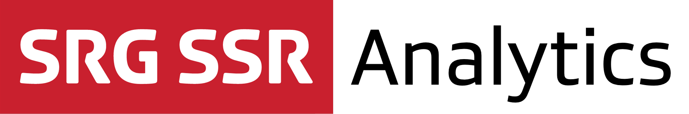

[](https://github.com/Carthage/Carthage)  

## About

The SRG Analytics library for iOS makes it easy to add usage tracking information to your applications, following the SRG SSR standards.

Measurements are based on events emitted by the application, and collected by comScore and NetMetrix. Currently, the following kinds of events are supported

 * View events: Appearance of views (page views), which makes it possible to track which content is seen by users
 * Hidden events: Custom events which can be used for measuresement of application functionalities
 * Media playback events: Measures audio and video consumption in conjunction with our [SRG Media Player library](https://github.com/SRGSSR/SRGMediaPlayer-iOS)
 
## Compatibility

The library is suitable for applications running on iOS 8 and above. The project is meant to be opened with the latest Xcode version (currently Xcode 8).

## Installation

The library can be added to a project using [Carthage](https://github.com/Carthage/Carthage)  by adding the following dependency to your `Cartfile`:
    
```
github "SRGSSR/srganalytics-ios"
```

Then run `carthage update` to update the dependencies. You will need to manually add one or several of the `.framework`s generated in the `Carthage/Build/iOS` folder to your projet, depending on your needs:

* Alway add at least `SRGAnalytics.framework` as well as `ComScore.framework`. If you only need view and hidden event tracking, these are the only frameworks required
* If you need media player event tracking, add `SRGAnalytics_MediaPlayer.framework` as well. Do not forget to add the `SRGMediaPlayer.framework` available from the same directory if your project wasn't already linking against it

For more information about Carthage and its use, refer to the [official documentation](https://github.com/Carthage/Carthage).

## Usage

When you want to classes or functions provided by the library in your code, you must import it from your source files first.

### Usage from Objective-C source files

Import the global header files using:

```objective-c
#import <SRGAnalytics/SRGAnalytics.h>	                            // For SRGAnalytics.framework
#import <SRGAnalytics_MediaPlayer/SRGAnalytics_MediaPlayer.h>       // For SRGAnalytics_MediaPlayer.framework
```

or directly import the modules themselves:

```objective-c
@import SRGAnalytics;                    // For SRGAnalytics.framework
@import SRGAnalytics_MediaPlayer;        // For SRGAnalytics_MediaPlayer.framework
```

### Usage from Swift source files

Import the module where needed:

```swift
import SRGAnalytics                     // For SRGAnalytics.framework
import SRGAnalytics_MediaPlayer         // For SRGAnalytics_MediaPlayer.framework
```

### Working with the library

To learn about how the library can be used, have a look at the [getting started guide](Documentation/Getting-started.md).

## Demo project

To test what the library is capable of, try running the associated demo by opening the workspace and building the associated scheme.

## Migration from versions 1.x

For information about changes introduced with version 2 of the library, please read the [migration guide](Documentation/Migration-guide.md).

## License

See the [LICENSE](LICENSE) file for more information.